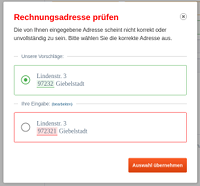
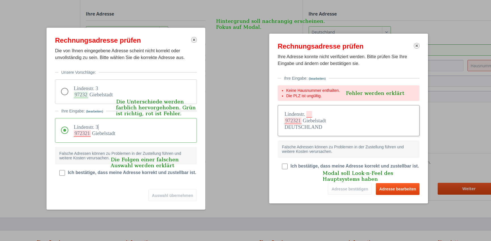

# Ui Guidelines

Falls ein Datensatz über Endereco API geprüft wird, werden in der Regel diverse Statuscodes zurückgegeben. 
Diese Statuscodes können einfach über Automatisierungen eingesetzt werden, jedoch kann ein normaler Benutzer mit ihnen nichts anfangen. 
Für ihn ist eine klare UI notwendig.

In diesem Dokument beschreiben wir von uns vorgesehene UI für diverse Verfahren, die unsere API abbilden kann.

## UI Elemente

| Element | Beispiel | Bedeutung |
|---|---|---|
| orangene Umrandung und Hintergrund der Eingabefelder |  | Warnung! Der Inhalt soll wahrscheinlich korrigiert werden. |
| rote Umrandung und Hintergrund der Eingabefelder |  | Fehler! Der Inhalt ist wahrscheinlich falsch. |
| grüne Umrandung und Hintergrund der Eingabefelder |  | Geprüft! Der Inhalt wurde geprüft und ist richtig. |
| orangene Warnung unter dem Eingabefeld |  | Warnung! In der Eingabe wurde möglicherweise ein Fehler gemacht. Die Warnung spezifiziert was falsch sein könnte.  |
| rote Fehlermeldung unter dem Eingabefeld |  | Fehler! In der Eingabe wurde wahrscheinlich ein Fehler gemacht. Die Fehlermeldung spezifiziert den Fehler. |
| Modal mit Korrekturvorschlägen |  | Bei Datensätzen, die aus mehreren Teilen bestehen, ist es einfacher die Korrekturen auf einem Schlag zu erledigen. Dafür ist ein Modal mit der ursprünglichen Eingabe und den Korrekturvorschlägen zu verwenden. Mehr dazu in [Modal](#modal). |
| Modal ohne Korrekturvorschlägen |  | Bei Datensätzen, die aus mehreren Teilen bestehen, für die jedoch kein Korrekturvorschlag vorliegt, soll auch ein Modal eingesetzt werden. Mehr dazu in [Modal](#modal). |

## Modal

Wenn eine Korrektur vorgeschlagen werden soll, ist es aus UX Sicht wichtig, dass man die ursprüngliche Eingabe und die 
Korrektur gegen einander vergleichen kann und auf die korrigierte Stellen aufmerksam gemacht wird. So bedarf eine 
Entscheidung, ob die Korrektur übernommen wird oder nicht den minimalen Aufwand. Der minimale Aufwand ist besonders 
für Onlineshop wichtig, da dort die Adressen der Käufer während Checkout geprüft werden und eine zu aufwändige 
Korrekturaufforderung zum Bestellabbruch führen kann.

Die Guideline von Endereco ist für diesen Prozess ein Modal zu verwenden.



1. Das Modal soll so früh wie möglich nach der Prüfung erscheinen. Der vorherige Prozess im System, 
i.d.R ist das Bestell- oder Registrierungsprozess, soll weiterhin im Hintergrund erscheinen, damit der Nutzer nicht zu 
stark aus dem Kontext gezogen wird. 
2. Der Hintergrund ist optisch abzustufen. Dafür eignet sich ein halbtransparenter schwarzer Hintergrund oder Blur Effekt. Der Fokus soll auf Modal liegen.
3. Die Inhalte des Modals sollen sich visuell an das Look-n-Feel des Systems orientieren. Es sind gleiche Schriften und Farben zu verwenden. Das betrifft am meisten die Buttons.
4. Der ursprünglich eingegebene Datensatz soll lesbar sein.
5. Falls es Korrekturvorschläge gibt, soll der am meisten zutreffende Korrekturvorschlag visuell oben sein und vorausgewählt werden. Die ursprüngliche Eingabe soll zuletzt kommen.
6. Falls es keine Korrekturvorschläge gibt, sollen gefundene Probleme in dem Datensatz als Text über dem Datensatz angezeigt werden. Dafür ist die entsprechende farbliche Kodierung zu verwenden.
7. In der ursprünglichen Eingabe solle korrigierbare Stellen mit rot oder orange markiert werden.
8. Bei einem Korrekturvorschlag sind die Stellen, die im Vergleich zu ursprünglichen Eingabe anders sind, grün zu markieren. So weiß der Nutzer, dass wenn er den Vorschlag auswählt, nur diese Stellen in seiner Eingabe angepasst werden.
9. Nach der Auswahl des Vorschlags sollen die Rahmenfarben der Eingabe auf grün geändert werden, weil der Vorschlag theoretisch immer richtig ist.
10. Falls der Nutzer sich für seine ursprüngliche Eingabe entscheidet oder seine Adresse bestätigt sind die Rahmenfarben zu behalten. Falls die Statuscodes in versteckten Feldern gespeichert werden, soll in diesem Fall noch der Statuscode "address_selected_by_customer" hinzugefügt werden.
11. Wenn mehrere Modale angezeigt werden müssen, müssen sie nacheinander kommen. Erst wenn das eine geschlossen wird, kommt das andere.
12. Das Modal ist für folgende Operationen einzusetzen

| Operation | Modal notwendig? | Kommentar |
| --- | --- | --- |
| PLZ-, Ort-, Straßenvervollständigung | nein | Modal würde die Eingabe blocken und wirkt belästigend. |
| Adressprüfung | ja | Im Modal hat man mehr Möglichkeiten zur Formatierung der Adressen und farblichen Markierung der problematischen Stellen. |
| Namensprüfung | nein | Modal nicht notwendig. Korrekturen sollen größtenteils automatisch vorgenommen werden. Ansonsten reicht die Rahmenmarkierung oder Warnhinweise unten den Eingabefeldern. |
| Telefonprüfung | nein | Modal nicht notwendig. Korrekturen sollen größtenteils automatisch vorgenommen werden. Ansonsten reicht die Rahmenmarkierung oder Warnhinweise unten den Eingabefeldern. |
| E-Mail Adresse Prüfung | nein | Modal nicht notwendig. Korrekturen sollen größtenteils automatisch vorgenommen werden. Ansonsten reicht die Rahmenmarkierung oder Warnhinweise unten den Eingabefeldern. |
| IBAN-Prüfung | optional | Modal könnte hilfreich sein. Korrekturen sollen größtenteils automatisch vorgenommen werden. Ansonsten reicht die Rahmenmarkierung oder Warnhinweise unten den Eingabefeldern. |
| Umsatzsteuer ID Prüfung | nein | Modal nicht notwendig. Korrekturen sollen größtenteils automatisch vorgenommen werden. Ansonsten reicht die Rahmenmarkierung oder Warnhinweise unten den Eingabefeldern. |

## Prüfung von Namen

Wenn ein Name geprüft wird, können wir kleine Schreibfehler (erster Buchstabe kleingeschrieben) erkennen. Wir erkennen 
außerdem, Vorname und Nachname verdreht wurden und ob die Anrede untypisch ist, z.B. "Herr" bei eindeutig weiblichen Namen.

Wenn die Namensprüfung einen Statuscode "name_needs_correction" zurückgibt, dann ist aus unserer Sicht eine Korrektur notwendig. Das Eingabefeld soll in diesem Fall mit orange

## Prüfung von Adressen

Bei Adressprüfung ist aktuell zwischen 5 Fällen zu unterscheiden:

1. [Korrekte Adresse](#korrekte-adresse)
2. [Mehrdeutige Adresse](#mehrdeutige-adresse)
3. [Korrekturbedürftige Adresse mit Korrekturvorschlägen](#korrekturbedürftige-adresse-mit-korrekturvorschlägen)
4. [Korrekturbedürftige Adresse ohne Korrekturvorschlägen](#korrekturbedürftige-adresse-ohne-korrekturvorschlägen)
5. [Eine nicht gefundene Adresse](#eine-nicht-gefundene-adresse)

### Korrekte Adresse

Statuscodes:
```
address_correct
```

Es soll kein Modal angezeigt werden. Die Adressteile sind mit grünen Rahmen zu markieren. Eventuell hinter den Eingaben
ein grünes Häkchen setzen.

### Mehrdeutige Adresse

Statuscodes:
``` 
address_multiple_variants
```
Es soll ein Modal mit möglichen Adressen angezeigt werden. Die vollständige Adresse soll orange markiert werden, auch wenn der Nutzer sie bestätigt.

Falls der Nutzer einen Vorschlag auswählt, soll die Adresse grün markiert werden. 

### Korrekturbedürftige Adresse mit Korrekturvorschlägen

Statuscodes:
``` 
address_needs_correction
```
``` 
Feld "predictions" ist nicht leer
```

Es soll ein Modal mit möglichen Korrekturen angezeigt werden. Die betroffene Teile der Adresse sollen orange markiert werden.

Falls der Nutzer einen Korrekturvorschlag auswählt, soll die ganze Adresse grün markiert werden.

### Korrekturbedürftige Adresse ohne Korrekturvorschlägen

Statuscodes:
``` 
address_needs_correction [building_number_not_found|building_number_missing]
```
``` 
Feld "predictions" ist leer
```

Es soll ein Modal mit der eingegebener Adresse angezeigt werden. In der Adresse sind korrekturbedürftige Teile rot zu markieren. 
Über der Adresse sollen die Fehler als Text ausgeschrieben werden.

### Eine nicht gefundene Adresse

Statuscodes:
``` 
address_not_found
```
``` 
Feld "predictions" ist leer
```

Es soll ein Modal mit der eingegebener Adresse angezeigt werden. Die Adresse soll neutral erscheinen.

## Prüfung von E-Mail Adressen

Falls die E-Mail Adresse nach der Prüfung fehlerhaft ist, soll das Eingabefeld orange umrandet werden.

## Prüfung von Telefonnummern

Falls die Telefonnummern nach der Prüfung fehlerhaft ist, soll das Eingabefeld orange umrandet werden.

## Prüfung von IBAN

Falls dieIBAN nach der Prüfung fehlerhaft ist, soll das Eingabefeld orange umrandet werden.

## Prüfung von Umsatzsteuer ID

Falls die Umsatzsteuer ID nach der Prüfung fehlerhaft ist, soll das Eingabefeld orange umrandet werden.
